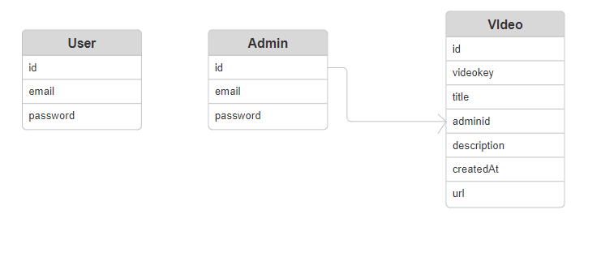

## Project Title: Custom Video Hosting Platform for Paul Leonard

## Project Objective
A bespoke video hosting platform tailored for Paul Leonard, enabling exclusive branding and better control over video content distribution. The platform will allow Paul to upload videos and share them with his customers without third-party branding interference.

### Customer Requirements

#### User Features
1. User Authentication
   - Signup with email and password
   - Login with email and password
   - Account verification through email
   - Reset password feature for recovering lost passwords

2. Navigation
   - Users can navigate through video pages seamlessly.
   - Users can share links to individual video pages.

#### Admin Features
- Admin (Paul Leonard) can upload videos with titles and descriptions.

#### Video Page Features
1. Displays a single video at a time.
2. Includes navigation buttons (Next and Previous) for browsing through videos.
   - If there are no further videos, the respective navigation button will be hidden.
3. Common video control buttons (play, pause, volume, etc.).
4. Prominently displayed business logo at the top.
5. Share button for users to share the link to the video page.

### Deliverables
1. Web Application Source Code
   - Hosted on GitHub
   - Implement Git flow with a reasonable number of commits
   - Well-written README file

2. ER Diagram
   - Detailed Entity-Relationship diagram of the database design
   

3. Deployed Application
   - Live deployment [link](https://video-platform-du1s.onrender.com)
   - Comprehensive technical documentation

### Technical Approach

#### Technology Stack
- Frontend: Used ejs html template for building the user interface.
- Backend: Node.js with Express.js for server-side logic.
- Database: MongoDB for storing user data, admin data and video metadata.
- Authentication: JWT (JSON Web Tokens) for secure user authentication.
- Storage: AWS S3 for storing video files.
- Hosting: Deployed on a cloud service named render.

### Implementation Plan

#### Phase 1: Planning and Setup
- Define the project scope and requirements.
- Set up the development environment and tools.
- Create the initial project structure in GitHub.

#### Phase 2: Backend Development
- Set up Express.js server and MongoDB database.
- Implement user authentication (signup, login, account verification, password reset).
- Create API endpoints for video (upload, retrieval, delete navigation), email service.

#### Phase 3: Frontend Development
- Design the UI/UX using ejs template.
- Implement user signup, login, and password reset pages.
- Create video page with navigation buttons, video controls, and share functionality.
- Integrate the frontend with backend APIs.

#### Phase 4: Video Management
- Develop the admin interface for video uploads.
- Implement video listing and navigation logic.

#### Phase 5: Testing and Deployment
- Perform testing.
- Deploy the application to the cloud via render.
- Ensure the deployed application is secure and scalable.

#### Phase 6: Documentation
- Write comprehensive technical documentation.
- Create the ER diagram for the database.
- Finalize the README file on GitHub.

### ER Diagram Overview
Entities:
1. User
   - id (PK)
   - email
   - password (hashed)
   - isVerified (boolean)

2. Admin
   - adminID
   - email
   - password

3. Video
   - id (PK)
   - videoID
   - title
   - description
   - adminID
   - url
   - createdAt

### Conclusion
This project aims to deliver a custom video hosting platform that meets Paul Leonard’s requirements, providing a branded and user-friendly environment for video content distribution. The solution will ensure a seamless experience for both the admin and users, with robust features and secure authentication mechanisms.

